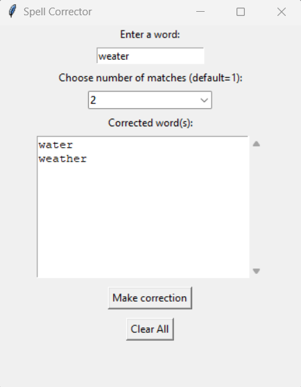

# Spell Corrector

## Table of Contents

1. [Prerequisites](#prerequisites)
2. [Setting Up](#setting-up)
3. [Running](#running)
3. [Usage Example](#usage-example)
4. [References](#references)

## Prerequisites

- Python>=3.10

## Setting up

Clone repo: `git clone https://github.com/ola-olek/spellcorrector.git`

Setup virtual environment: `python -m venv venv`

Activate your virtual environment:
- Unix: `source venv/bin/activate`
- Windows: `venv\Scripts\activate.bat`

Install requirement: `pip install -r requirement.txt`

## Running

Just write in your terminal: `python main.py`. Simple window should be opened.

## Usage example

## References
https://www.norvig.com/spell-correct.html
